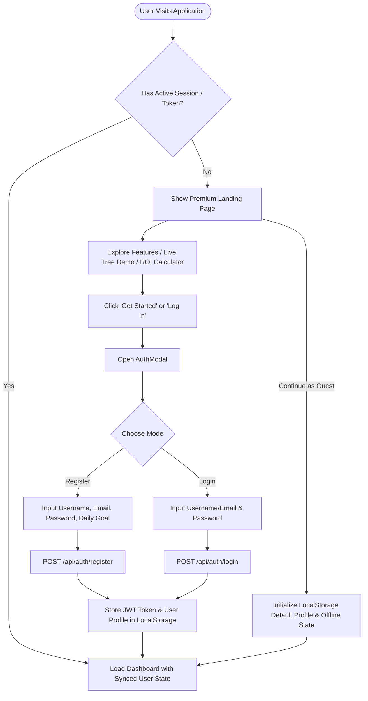
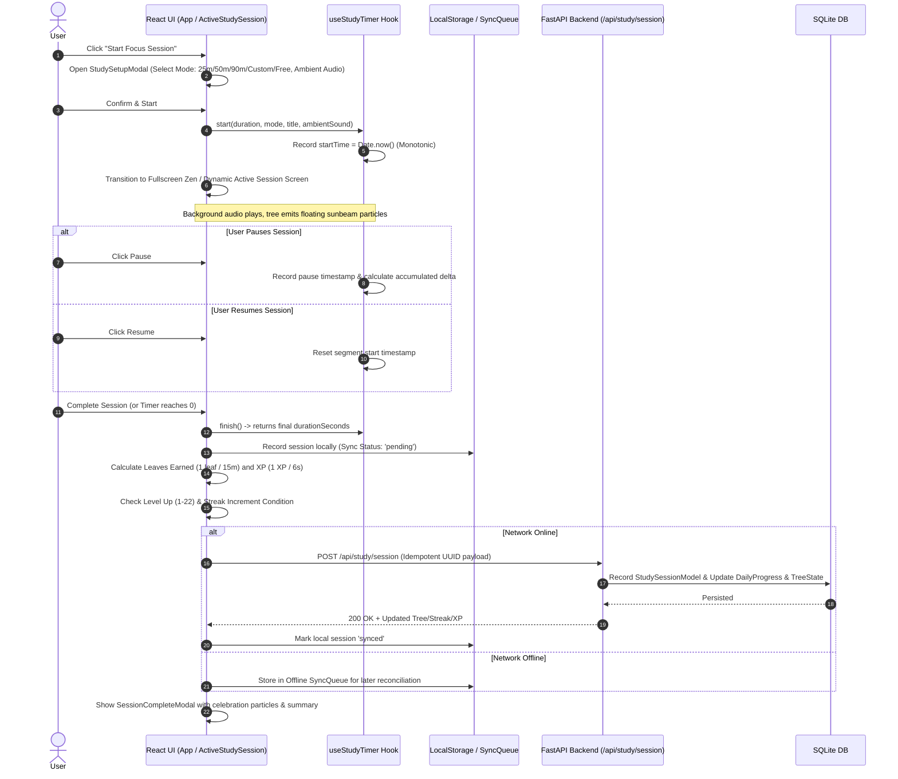
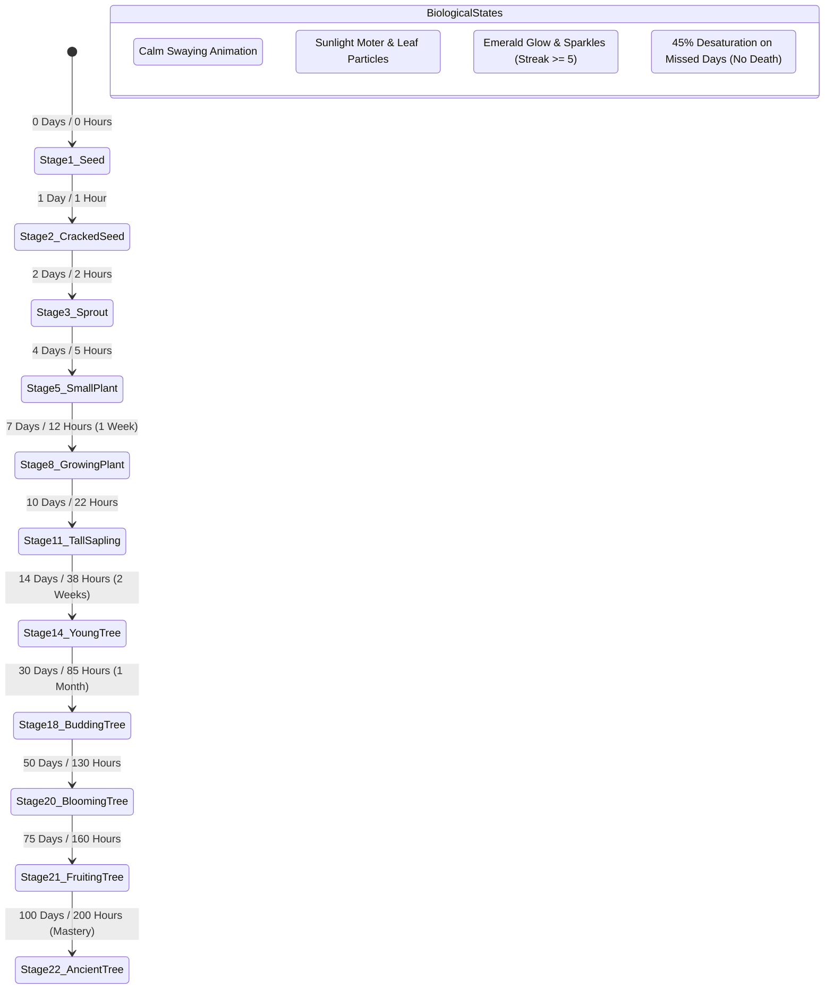
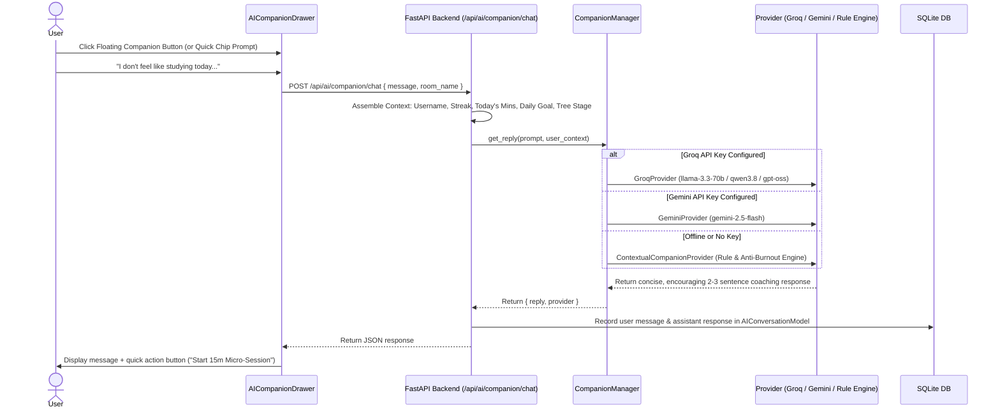
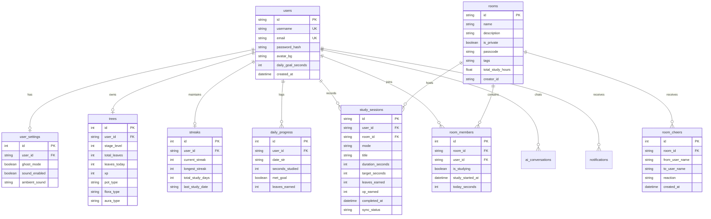

# XemStreak: User Workflow & System Architecture

> **Product Name:** XemStreak (by Xempla AI)  
> **Core Concept:** Gamified Study Streak & Focus Progressive Web App (PWA) with Calm Gamification, 22-Stage Botanical Tree Growth, Collaborative Focus Rooms, and an AI Study Companion.  
> **Document Purpose:** Comprehensive functional workflow specification and end-to-end technical system architecture.

---

## Table of Contents
1. [Executive Summary & Core Metaphor](#1-executive-summary--core-metaphor)
2. [End-to-End User Workflows](#2-end-to-end-user-workflows)
   - [2.1 Landing, Onboarding & Authentication Workflow](#21-landing-onboarding--authentication-workflow)
   - [2.2 Daily Focus & Study Session Lifecycle](#22-daily-focus--study-session-lifecycle)
   - [2.3 Botanical Tree Evolution & Sanctuary Customization](#23-botanical-tree-evolution--sanctuary-customization)
   - [2.4 Collaborative Study Rooms & Social Cheer Workflow](#24-collaborative-study-rooms--social-cheer-workflow)
   - [2.5 AI Study Companion Interaction Workflow](#25-ai-study-companion-interaction-workflow)
   - [2.6 Offline-First Execution & Synchronization Workflow](#26-offline-first-execution--synchronization-workflow)
   - [2.7 Analytics & Habit Consistency Tracking](#27-analytics--habit-consistency-tracking)
3. [System Architecture](#3-system-architecture)
   - [3.1 High-Level Architecture Diagram](#31-high-level-architecture-diagram)
   - [3.2 Frontend Architecture (React + Vite + TypeScript)](#32-frontend-architecture-react--vite--typescript)
   - [3.3 Backend Architecture (FastAPI + Python)](#33-backend-architecture-fastapi--python)
   - [3.4 Database Schema & Relational Models (SQLite)](#34-database-schema--relational-models-sqlite)
   - [3.5 Multi-Provider AI Subsystem Architecture](#35-multi-provider-ai-subsystem-architecture)
   - [3.6 Data Synchronization & Idempotency Pipeline](#36-data-synchronization--idempotency-pipeline)
   - [3.7 Design System & Visual Tokens](#37-design-system--visual-tokens)
4. [Security, Scalability & Anti-Abuse Engineering](#4-security-scalability--anti-abuse-engineering)
5. [Summary & Technology Stack Index](#5-summary--technology-stack-index)

---

## 1. Executive Summary & Core Metaphor

XemStreak transforms daily academic and deep-work habits into a living **Digital Garden**. Instead of punitive streak mechanics that trigger anxiety and burnout (e.g., losing all progress if one day is missed), XemStreak leverages **Calm Gamification**:

```
┌────────────────────────────────────────────────────────┐
│                   THE BOTANICAL ENGINE                 │
├────────────────────────────────────────────────────────┤
│  Knowledge      =  Living Organism (Tree)              │
│  Consistency    =  Nutrients & Water (Streak Days)     │
│  Deep Work      =  Photosynthesis & Sunlight (Hours)   │
│  Missed Days    =  Gentle Dormancy (No Tree Death)     │
└────────────────────────────────────────────────────────┘
```

The system is built as an **offline-first Progressive Web App (PWA)** backed by a **FastAPI + SQLite** backend and integrated with **Groq / Gemini AI** for contextual, empathetic study support.

---

## 2. End-to-End User Workflows

### 2.1 Landing, Onboarding & Authentication Workflow



1. **Discovery & Exploration:** Users land on the editorial landing page showcasing live feature demos, 22-stage sprite progression, ambient audio previews, and social room features.
2. **Flexible Access:** Users can start immediately as a local guest (stored in `localStorage`) or authenticate to enable cross-device synchronization.
3. **Registration / Login:** The backend generates secure bcrypt password hashes and issues standard JWT bearer access tokens with user profile, streak, and tree status.

---

### 2.2 Daily Focus & Study Session Lifecycle



---

### 2.3 Botanical Tree Evolution & Sanctuary Customization

The user's tree grows through **22 distinct botanical stages** gated by dual criteria: **Streak Days** and **Total Focus Hours**.



#### Sanctuary Cosmetics & Milestone Unlocks:
* **3-Day Streak:** Terracotta Planter (`pot_type: 'terracotta'`)
* **7-Day Streak:** Sakura Cherry Blossoms (`flora_type: 'sakura_blossom'`)
* **14-Day Streak:** Glazed Cobalt Ceramic Pot (`pot_type: 'glazed_ceramic'`)
* **30-Day Streak:** Morning Sunbeam Glow (`aura_type: 'sunbeam'`)
* **50-Day Streak:** Gilded Golden Leaves (`flora_type: 'golden_leaves'`)
* **100-Day Streak:** Hand-Carved Zen River Stone (`pot_type: 'zen_stone'`)
* **365-Day Streak:** Celestial Starlight Mythic Aura (`aura_type: 'celestial'`)

Users can inspect all stages in the `TreeEvolutionModal` and customize their personal garden environment in the `TreeRoomModal`.

---

### 2.4 Collaborative Study Rooms & Social Cheer Workflow

```mermaid
flowchart TD
    A[User Opens 'Study Rooms' Section] --> B{Browse Rooms}
    B --> C[Public Rooms: 'DSA Grind', 'Library Silent Floor', 'Late Night Lo-Fi']
    B --> D[Private Rooms: Requires Passcode]
    B --> E[Create New Room: Custom Tags, Privacy, Passcode]

    C & D --> F[Open RoomDetailModal]
    F --> G[View Active Members & Live Timers]
    F --> H[View Today's Study Leaderboard]
    F --> I[Send Micro-Cheer: 🔥 Flame | 👏 Clap | ☕ Coffee | 🎉 Party]
    I --> J[POST /api/rooms/{id}/cheer]
    J --> K[Broadcast to Room Cheers Feed]

    F --> L[Toggle 'Ghost Mode' in Settings]
    L -- Enabled --> M[Study incognito: personal progress tracked, hidden from public room view]
    L -- Disabled --> N[Live '🟢 Studying' badge & timer broadcasted]
```

---

### 2.5 AI Study Companion Interaction Workflow

The built-in AI Study Companion acts as an empathetic, calm mentor that possesses full situational awareness of the user's progress:



---

### 2.6 Offline-First Execution & Synchronization Workflow

```mermaid
flowchart LR
    subgraph OfflineMode [Offline State (No Internet)]
        A1[User Finishes Focus Session] --> A2[Calculate XP & Leaves Locally]
        A2 --> A3[Save to LocalStorage StorageService]
        A3 --> A4[Enqueue in SyncQueue with Client UUID & 'pending' status]
        A4 --> A5[Update UI Tree & Streak Reactively]
    end

    subgraph OnlineReconnection [Network Restored]
        B1[Browser 'online' Event / API Health Poll] --> B2[syncManager.triggerSync()]
        B2 --> B3[POST /api/sync/batch with Pending Queue]
        B3 --> B4[FastAPI Deduplication: Filter out existing session IDs]
        B4 --> B5[Update SQLite DB: StudySession, DailyProgress, TreeState, Streak]
        B5 --> B6[Return BatchSyncResponse with Total Synced Stats]
        B6 --> B7[Clear Offline SyncQueue & Set status='synced']
    end

    A5 -.-> B1
```

---

### 2.7 Analytics & Habit Consistency Tracking

The `AnalyticsModal` provides deep insights into study trends:
1. **Today's Goal vs Actual:** Visual radial / progress bar comparison.
2. **7-Day Habit Heatmap / Week Trend:** Bar graph of daily minutes vs daily goal threshold.
3. **All-Time Key Metrics:** Total hours logged, total leaves grown, longest streak, current streak, tree level.
4. **Consistency Rating:** Algorithmic score calculated from goal completion ratio over the rolling 7-day window.

---

## 3. System Architecture

### 3.1 High-Level Architecture Diagram

```mermaid
graph TB
    subgraph ClientTier [Client Tier: React 19 + TypeScript + Vite PWA]
        direction TB
        UI_Nav[Navigation & Navbar]
        UI_Tree[Tree Display & Sprite Engine]
        UI_Study[Focus Timer & Zen Mode]
        UI_Rooms[Collaborative Rooms & Cheers]
        UI_AI[AI Study Companion Drawer]
        UI_Analytics[Analytics & Heatmaps]
        
        State_Local[(Browser Storage: LocalStorage / IndexedDB)]
        Sync_Queue[Offline Sync Queue Manager]
        Audio_Engine[Web Audio Ambient Soundscapes]
    end

    subgraph APITier [API Gateway & Backend: FastAPI (Python 3.10+)]
        direction TB
        Auth_Middleware[JWT Auth & Bearer Middleware]
        Study_Router[Study & Session Endpoints]
        Sync_Router[Offline Batch Sync Router]
        Room_Router[Study Rooms & Cheer Service]
        AI_Router[AI Companion Gateway Router]
        Analytics_Router[Analytics & Reporting Engine]
    end

    subgraph PersistenceTier [Data & Persistence Tier: SQLite]
        DB_Users[(users & user_settings)]
        DB_Trees[(trees & streaks)]
        DB_Sessions[(study_sessions & daily_progress)]
        DB_Rooms[(rooms, room_members & room_cheers)]
        DB_AI[(ai_conversations & achievements)]
    end

    subgraph ExternalServices [External AI Providers]
        Groq_API[Groq API: Llama-3.3-70b / Qwen]
        Gemini_API[Google Gemini 2.5 Flash API]
        Local_AI[Built-in Contextual Companion Engine]
    end

    ClientTier -->|HTTPS REST / JSON| APITier
    Sync_Queue -->|POST /api/sync/batch| Sync_Router
    APITier -->|SQLAlchemy ORM| PersistenceTier
    AI_Router --> Groq_API
    AI_Router --> Gemini_API
    AI_Router --> Local_AI
```

---

### 3.2 Frontend Architecture (React + Vite + TypeScript)

The frontend is structured into modular domain components, robust services, and dedicated hooks:

```
src/
├── assets/                  # Ambient sound effects, brand logos, static graphics
├── components/
│   ├── AICompanion/         # AICompanionDrawer, FloatingAICompanionButton
│   ├── Analytics/           # AnalyticsModal (7-day heatmaps, consistency scoring)
│   ├── Auth/                # AuthModal (Login, Registration, Token storage)
│   ├── Landing/             # Editorial SaaS Landing Page, Feature Demos, Previews
│   ├── Navigation/          # Responsive Navbar, Level badges, Leaf counters
│   ├── PersonalSpace/       # TreeRoomModal (Garden customization, equipped pots/auras)
│   ├── Rooms/               # RoomsSection, RoomCard, RoomDetailModal, CreateRoomModal
│   ├── Streak/              # StreakCard, MilestonesModal, Reward unlock dialogs
│   ├── Study/               # ActiveStudySession, StudySetupModal, SessionCompleteModal
│   ├── Tree/                # TreeDisplay, TreeEvolutionModal (22-stage sprite renderer)
│   └── UI/                  # Card, Button, StatTile, ProgressBar, Modal primitives
├── hooks/
│   └── useStudyTimer.ts     # Monotonic timer hook, timestamp delta calculations
├── services/
│   ├── api.ts               # Axios / Fetch client with JWT authorization headers
│   ├── storage.ts           # LocalStorage adapter, stage calculation formulas
│   └── syncQueue.ts         # Offline FIFO queue manager with automatic sync
├── types/
│   └── index.ts             # Complete TypeScript data contracts
├── index.css                # Plus Jakarta Sans, Xempla light tokens, animations
├── main.tsx                 # React DOM mount point
└── App.tsx                  # Root state orchestration & modal routing
```

#### Sprite Rendering Engine:
The tree component dynamically maps the user's level (1 to 22) to individual, pixel-perfect sprite frames located at `public/sprites/stage_X.png`. It wraps the sprite with responsive CSS ambient animations (`treeGentleSway`, `particleFloat`, `dormantDesaturate`).

---

### 3.3 Backend Architecture (FastAPI + Python)

The backend is built with **FastAPI** for high throughput, strict schema validation via **Pydantic**, and clean relational mapping via **SQLAlchemy**:

```
backend/
├── ai_service.py            # AI Provider abstraction (Gemini, Groq, Contextual engine)
├── auth.py                  # Bcrypt hashing, JWT token creation and validation
├── database.py              # SQLite engine, sessionmaker, Base declarative models
├── main.py                  # FastAPI route controllers, CORS, and lifecycle setup
├── models.py                # SQLAlchemy ORM model definitions
├── schemas.py               # Pydantic request/response validation schemas
├── seed.py                  # Initial seed data for demo rooms, milestones, and users
└── study_streak.db          # Local relational SQLite database
```

#### REST API Endpoint Matrix:
| Method | Endpoint | Description | Protected |
|:---|:---|:---|:---:|
| `GET` | `/api/health` | Service health & timestamp check | No |
| `POST` | `/api/auth/register` | Register new user & initialize tree/streak | No |
| `POST` | `/api/auth/login` | Authenticate user & return JWT token | No |
| `GET` | `/api/auth/me` | Fetch active user profile, tree state, and streak | Yes |
| `POST` | `/api/study/session` | Record a completed study session (Idempotent) | Yes |
| `GET` | `/api/study/analytics` | Fetch 7-day consistency stats & aggregated hours | Yes |
| `POST` | `/api/sync/batch` | Synchronize multiple offline sessions | Yes |
| `GET` | `/api/rooms` | List all public & private study rooms with member state | No |
| `POST` | `/api/rooms` | Create a new study room | Yes |
| `GET` | `/api/rooms/{id}/leaderboard` | Get room daily study leaderboard | Optional |
| `POST` | `/api/rooms/{id}/cheer` | Send a micro-cheer reaction (🔥, 👏, ☕, 🎉) | Yes |
| `GET` | `/api/rooms/{id}/cheers` | Get last 20 cheers sent in a study room | No |
| `POST` | `/api/ai/companion/chat` | Contextual AI chat with multi-provider failover | Yes |

---

### 3.4 Database Schema & Relational Models (SQLite)



---

### 3.5 Multi-Provider AI Subsystem Architecture

The AI module implements the **Abstract Factory / Strategy Pattern** to guarantee 100% uptime:

```
                      ┌────────────────────────────┐
                      │    FastAPI Companion Chat  │
                      └─────────────┬──────────────┘
                                    │
                                    ▼
                      ┌────────────────────────────┐
                      │      CompanionManager      │
                      └─────────────┬──────────────┘
                                    │
            ┌───────────────────────┼───────────────────────┐
            ▼                       ▼                       ▼
┌───────────────────────┐ ┌───────────────────┐ ┌───────────────────────┐
│     GroqProvider      │ │  GeminiProvider   │ │  ContextualProvider   │
│  (Llama-3.3-70b-v)    │ │ (gemini-2.5-flash)│ │ (Zero-Config Fallback)│
└───────────────────────┘ └───────────────────┘ └───────────────────────┘
```

1. **Context Assembly:** Upon receiving a prompt, the system extracts the user's active metrics: `username`, `streak`, `today_minutes`, `goal_minutes`, `tree_level`, `tree_name`, and `room_name`.
2. **Strict System Instructions:** Models are instructed to act as a calm, anti-burnout coach, keeping replies concise (2–3 sentences) and recommending micro-steps for resistance.
3. **Graceful Degradation:** If external API quotas expire or network errors occur, the internal `ContextualCompanionProvider` handles requests using deterministic psychological response patterns.

---

### 3.6 Data Synchronization & Idempotency Pipeline

1. **Client-Side UUIDs:** Every study session is minted with a client-side UUID (e.g. `session-1727078400000-abcd`) when created.
2. **Local-First Write:** The session is immediately written to local storage and the UI updates reactively.
3. **Idempotent Reconciliation:** When syncing with `POST /api/study/session` or `POST /api/sync/batch`, the backend performs an existence check:
   ```python
   existing = db.query(StudySessionModel).filter(StudySessionModel.id == req.id).first()
   if existing:
       return existing  # Return successfully without duplicate XP/streak inflation
   ```
4. **Calendar Day Normalization:** Streak and daily goal updates are computed against normalized ISO date strings (`YYYY-MM-DD`), preventing clock drift issues.

---

### 3.7 Design System & Visual Tokens

The application follows the **Xempla Light** design system defined in `xempla-design.md`:

| Token | Hex Value | Application |
|:---|:---|:---|
| **Primary** | `#1D8DEA` | Vivid electric blue for primary CTAs, links, and highlighted metrics |
| **Secondary** | `#000000` | Deep black for high-contrast headlines and assertive elements |
| **Tertiary / Border** | `#D9E8FF` | Pale blue tint for card borders, dividers, and subtle containers |
| **Surface** | `#F6F9FE` | Airy cool background for main layouts and elevated panels |
| **Neutral** | `#FFFFFF` | Pure white for cards, modals, and input fields |
| **Muted** | `#5E6677` | Cool gray-blue for supportive body text, timestamps, and subtitles |
| **Success** | `#18B85A` | Natural botanical emerald for leaves, streaks, and positive deltas |
| **Error** | `#D64545` | Restrained red for destructive confirmations or validation alerts |

* **Typography:** `Plus Jakarta Sans` (weights: 400 Regular, 500 Medium, 600 SemiBold, 700 Bold, 800 ExtraBold).
* **Corner Radii:** `10px` for buttons and inputs, `14px` for cards and panels, `9999px` for pill chips.

---

## 4. Security, Scalability & Anti-Abuse Engineering

1. **Monotonic System Clock Calculation:**
   Timer intervals in `useStudyTimer.ts` do not simply increment seconds using `setInterval(sec++)` (which can lag when tabs sleep). Instead, they compute deltas from `Date.now() - startTime`, ensuring exact elapsed time even across tab suspension and lock screens.
2. **Session Throttling & Soft Caps:**
   - Sessions under 3 minutes (180s) yield 0 leaves to prevent rapid farming.
   - Daily XP soft-caps after 4 hours of study (minutes beyond 240 generate 50% XP) to discourage unhealthy sleep deprivation.
3. **Secure Credential Isolation:**
   All external API keys (`GROQ_API_KEY`, `GEMINI_API_KEY`, `JWT_SECRET_KEY`) reside exclusively in backend environment variables and are never bundled into the client distribution.
4. **Ghost Mode Privacy:**
   Users who wish to focus without social visibility can toggle Ghost Mode. Their active timer status is omitted from public room broadcasts while preserving their personal streak and tree leveling.

---

## 5. Summary & Technology Stack Index

```
┌────────────────────────────────────────────────────────────────────────┐
│                        XEMSTREAK TECHNOLOGY STACK                      │
├───────────────────┬────────────────────────────────────────────────────┤
│ Frontend          │ React 19, TypeScript, Vite, TailwindCSS / PostCSS  │
│ State & Offline   │ React Hooks, LocalStorage, SyncQueue (FIFO)        │
│ Design & Icons    │ Plus Jakarta Sans, Lucide React, Canvas Confetti   │
│ Audio Engine      │ HTML5 Web Audio Ambient Soundscapes                │
│ Backend           │ Python 3.10+, FastAPI, Uvicorn                     │
│ ORM & DB          │ SQLAlchemy 2.0, SQLite (WAL mode)                  │
│ Auth & Security   │ Passlib (Bcrypt), Python-Jose (JWT Tokens)         │
│ AI Intelligence   │ Groq SDK (Llama 3.3), Google GenAI, Fallback Rule  │
└───────────────────┴────────────────────────────────────────────────────┘
```

This architecture provides a scalable, offline-resilient, calm study environment that transforms daily effort into organic botanical growth.
